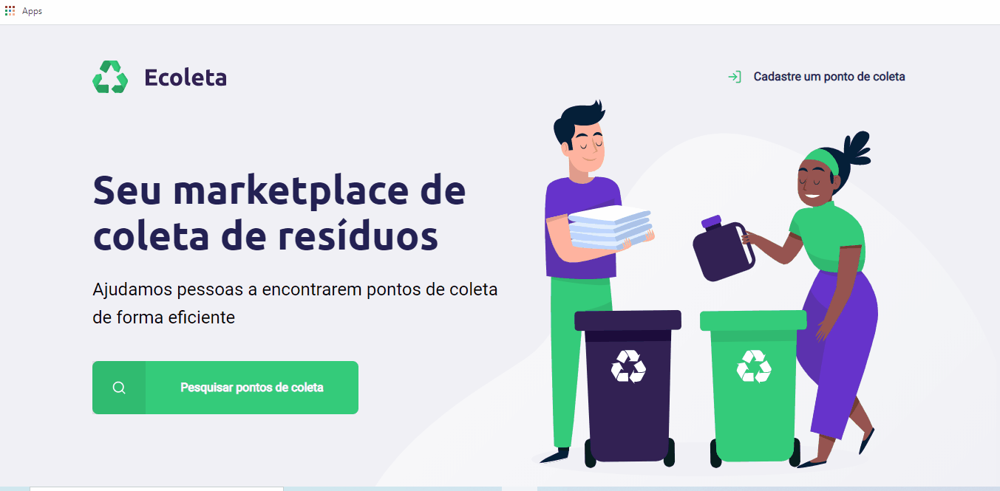

<p align="center">
  
</p>

<h2 align="center"> 
  "O NextLevelWeek é uma experiência online com muito conteúdo prático, desafios e hacks que vão te ajudar avançar para o próximo nível."
</h2>

<h5 align="center"> 
 Projeto realizado com o intuito de por em prática conhecimento para o desenvolvimento web full stack
</h5>

<p align="center">
  
  <a href="https://www.linkedin.com/in/jefferson-c-silva">
    
  </a>
</p>

## 💻 Projeto

Ecoleta é um projeto idealiazado pela <a href="https://github.com/Rocketseat">rocktseat</a>, tem como objetivo conectar pessoas com empresas que realizam
coletas de materiais especificos para reciclagem.

<h1 align="center">
    
</h1>
<h1 align="center">
    
</h1>

## 💻 Tecnologias

- HTML
- CSS
- Javascript
- Node.js
- Express
- Nunjucks
- Sqlite3

## How to Install

```bash
# Clone this repository
$ git clone https://github.com/Jefferson00/ecoleta.git

# Go into the repository
$ cd ecoleta

# Install dependencies
$ npm install

# Start the application
$ npm start
```

Made with ♥ by Jefferson C Silva :wave: [Get in touch!](https://www.linkedin.com/in/jefferson-c-silva)
